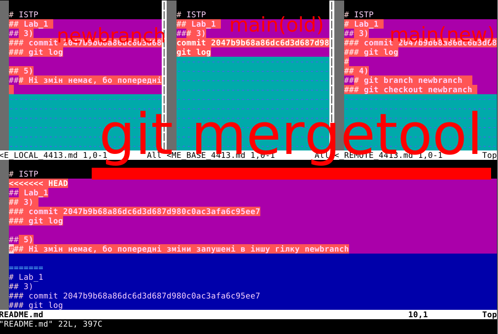

# ISTP
## Lab_1 
## 3) 
##### commit 2047b9b68a86dc6d3d687d980c0ac3afa6c95ee7
##### git log
#
## 4)
##### git branch newbranch  
##### git checkout newbranch 
#
## 5)
###### Ні змін немає, бо попередні зміни запушені в іншу гілку newbranch
#
## 7)
###### Конфлікт виник тому, що обидва файли були змінені і їх намагалися об'єнати. Конфлікт вирішений вручну з допомогою 
##### git mergetool 
###### також був доданий не об'язковий файл з розширенням .orig який мав зберігати дані проконфлікт злиття гілок 
#
## 9) Web 
###### На локальному комп'ютері змін Web версії немає. Для  синхронізації.
##### git pull origin main
##
## 10)

