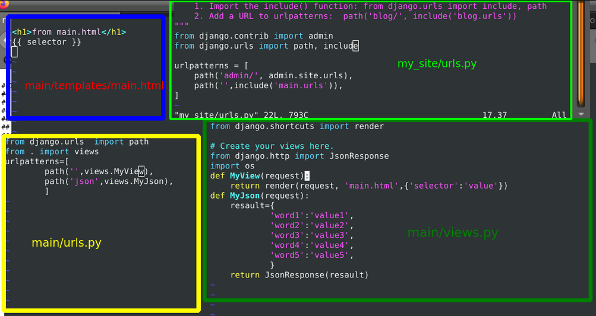

# 1-3
```
pipenv --three
pipenv shell
pipenv install django
pipenv run django-admin startproject my_site
cd my_site ; mv manage.py ./ ; mv my_site/* ./ ; rm my_site
pipenv run python manage.py runserver
```
# 4
#### Lab3:1st commit
# 5-6
```
pipenv run python manage.py startapp main
cd main ; mkdir templates ; touch templates/main.html ; touch urls.py
```

# 7-10

#### Зробивши прості маніпуляції в файлах my_site/urls.py, main/urls.py, main/views.py, main/templates/main.html сторінки працють і доступні.



# 11-13
#### Відповіді json модифіковані і лог ведеться

