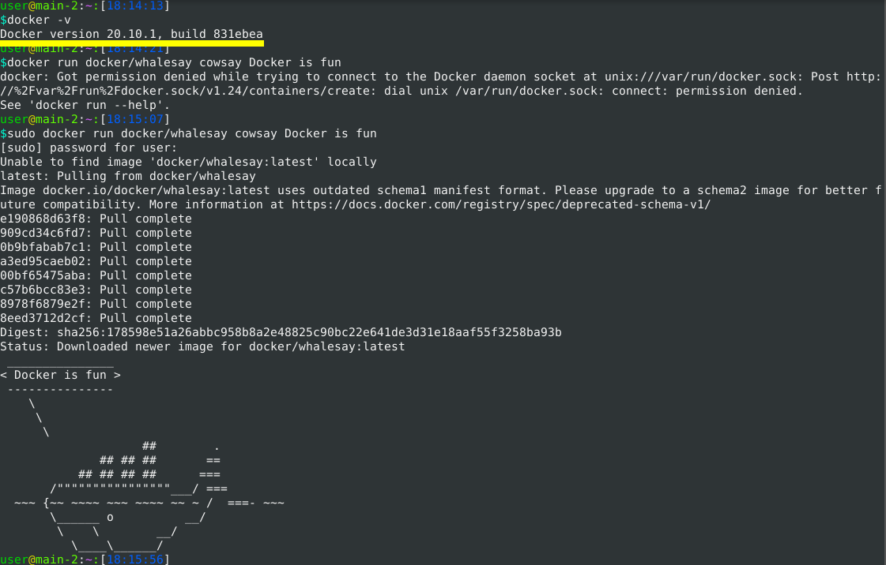
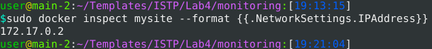
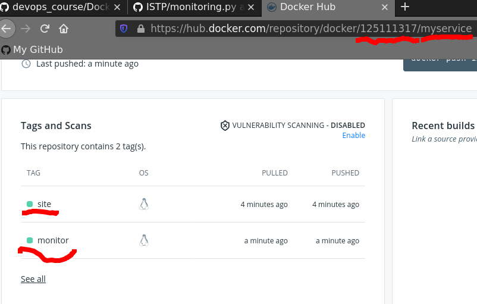

# 1-2
#### my_work.log complete

# 3-9
#### В цій лабораторній роботі зроблено 2 docker image  
#### 1) це сам робочий сайт з попередньої роботи він доступний за командою
```
docker pull 125111317/myservice:site
```
#### для запуску наступна команда:
```
docker run --name mysite -d 125111317/myservice:site
```
#### 2) файл це програмка моніторингу винесена в окремий image її лог монтується в /mylog/ в контейнері.
```
docker pull 125111317/myservice:monitor
docker run --name monitoring  -v $(pwd):/mylog  --link mysite:monitoring   --rm  125111317/myservice:monitor
```
#### лог буде доступний вже в поточній папці
#### Щоб попасти на сервер треба дізнатися ip адресу:
```
docker inspect mysite --format {{.NetworkSettings.IPAddress}}
```


# https://hub.docker.com/repository/docker/125111317/myservice

