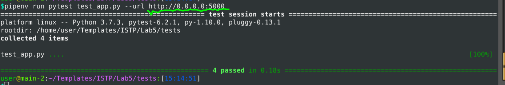
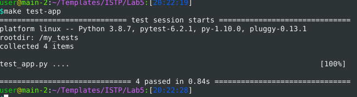
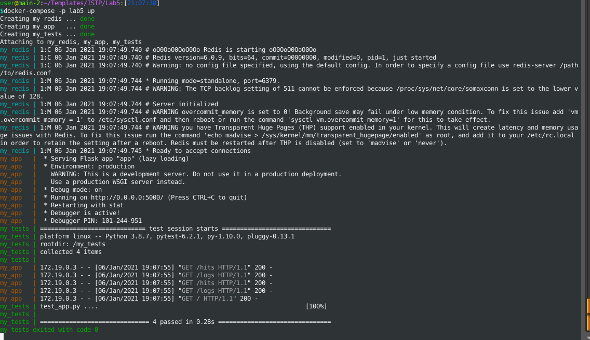

# 1-3 
#### Ознайомився з docker-compose, Makefile, бііліотекою Flask.
# 4-5 
#### Створив відповідні директорії і копіював відповідні файли в них. Ознайомився з вмістом.
# 6
#### Ініціалізував середовище. Також для тестів. Сайт був не працездатним з трьох причин 
#### 1) Не було локального редіс сервера.Рішення: потрібно було інсталювати redis  на локальний комп'ютер 
#### 2) Застосунок посилався на інший hostname Рішення: замінити в ./my_app/app.py hostname='redis' нa 'localhost' або додати відповідні записи в /etc/hosts хоста. 
#### 3) Застосунок потребував повних шляхів до файлу logs/app.log Рішення: дописати функцію яка створює повний шлях або викликає виключення з відповідеим повідомленням повідомлення. (код варто оптимізувати)
#### Тести пройшли успішно. Помилки не з'явилися однак треба було замінити localhost:5000 на 0.0.0.0:5000

# 7 
#### Видалив Pipfile i Pipfile.lock.
#### Зробив відповідні Dockerfile збілдив, відлагодив, запушив на DockerHub вони доступні за посиланням [lab5](https://hub.docker.com/repository/docker/125111317/lab5).
#### Скачав і модифікував Makefile.
# 8-12
#### Опис Makefile(модифікованого):
#### Перші дві строки це присвоєння переміним STATES повина бути списком якій умовно буде ітеруватися в відповідній функції $(STATES):, REPO вказуватиме на репозитоій. .PHONY: $(STATES) -функція по замовчкванню вона викликається коли make немає аргументів (По замовчуванню бо вона 1 функція).
#### Функція $(STATES): повинна була викликатися двічі і мати в собі спочатку значення app, а потім tests. Це було зроблено щоб не дублювати код однак це не спрацювало і код всеж треба було дуюлювати. Вона повинна збілдити із Dockerfile два images у відповідних директоріях.
#### Функція run: повинна запустити my_redis i my_app контейнери із відповідеих images. А також вивести посилання на робочий застосунок.
#### test-app: запускає контейнер my_test.
#### pull: скачує із репозиторія відповідні image.
#### stop: зупиняє my_redis i my_app.
#### rm: видаляє всі контейнери. 
#### rmi: видаляє всі імеджі.
#### push: пушить імеджі в DockerHub (треба бути залогіненим)
#### Результат виконання 8-12:

```
user@main-2:~/Templates/ISTP/Lab5:[17:48:18]
$make 
125111317/lab5:/app
Sending build context to Docker daemon  8.192kB
Step 1/8 : FROM python:3.8
 ---> f5041c8ae6b1
Step 2/8 : RUN mkdir my_app
 ---> Using cache
 ---> ec54577e3216
Step 3/8 : COPY ./ /my_app/
 ---> Using cache
 ---> 9aec920b4058
Step 4/8 : RUN pip3 install pipenv
 ---> Using cache
 ---> c1411c140af4
Step 5/8 : WORKDIR /my_app/
 ---> Using cache
 ---> bb002b710663
Step 6/8 : RUN pipenv install -r requirements.txt
 ---> Using cache
 ---> 1888d91af17c
Step 7/8 : EXPOSE 5000
 ---> Using cache
 ---> 965a23ab9905
Step 8/8 : ENTRYPOINT ["pipenv","run","python3","app.py"]
 ---> Using cache
 ---> ad64e6ec6394
Successfully built ad64e6ec6394
Successfully tagged app:latest
#ibecause dont work with tests only with app work
Sending build context to Docker daemon  13.31kB
Step 1/7 : FROM python:3.8
 ---> f5041c8ae6b1
Step 2/7 : RUN mkdir my_tests
 ---> Using cache
 ---> 93d433424645
Step 3/7 : COPY ./ /my_tests/
 ---> Using cache
 ---> e5ebed128ea6
Step 4/7 : RUN pip3 install pipenv
 ---> Using cache
 ---> 6aa74a5ddfc9
Step 5/7 : WORKDIR /my_tests/
 ---> Using cache
 ---> 23e567d63c08
Step 6/7 : RUN pipenv install -r requirements.txt
 ---> Using cache
 ---> 2e153c3570a8
Step 7/7 : ENTRYPOINT ["pipenv","run","pytest","test_app.py","--url","http://my_app:5000"]
 ---> Using cache
 ---> 38f55e335b82
Successfully built 38f55e335b82
Successfully tagged tests:latest
user@main-2:~/Templates/ISTP/Lab5:[17:48:26]
$make run
65028cc2594b2f72a55d40bfcfa6994cbf8a1dce093958b5261f6def7a325c8c
f2481377b1b4fa6bbd82e2c3a1ac560024f1da66920069f6f841903e36fc818a
http://172.17.0.3:5000
user@main-2:~/Templates/ISTP/Lab5:[17:48:34]
$make test-app
59bd420ac2837402a85542a13115e29619726c7de7801e3e856cb9be07565ff4
user@main-2:~/Templates/ISTP/Lab5:[17:48:45]
$make pull
app: Pulling from 125111317/lab5
Digest: sha256:ebeca5a81c1f6993ee3001332a30019208fcbeee25cb65f11d5cbabfd9633038
Status: Image is up to date for 125111317/lab5:app
docker.io/125111317/lab5:app
tests: Pulling from 125111317/lab5
Digest: sha256:f980d383a28dd6e20c8df5fcd90deb41244cb639f61fced6e96e0ee77fc8165e
Status: Image is up to date for 125111317/lab5:tests
docker.io/125111317/lab5:tests
user@main-2:~/Templates/ISTP/Lab5:[17:49:01]
$docker ps -a
CONTAINER ID   IMAGE                  COMMAND                  CREATED          STATUS                      PORTS      NAMES
59bd420ac283   125111317/lab5:tests   "pipenv run pytest t…"   33 seconds ago   Exited (1) 28 seconds ago              my_test
f2481377b1b4   125111317/lab5:app     "pipenv run python3 …"   44 seconds ago   Up 41 seconds               5000/tcp   my_app
65028cc2594b   redis                  "docker-entrypoint.s…"   46 seconds ago   Up 43 seconds               6379/tcp   my_redis
user@main-2:~/Templates/ISTP/Lab5:[17:49:16]
$make stop
my_redis
my_app
user@main-2:~/Templates/ISTP/Lab5:[17:49:31]
$make rm
59bd420ac283
f2481377b1b4
user@main-2:~/Templates/ISTP/Lab5:[17:49:35]
$docker ps -a
CONTAINER ID   IMAGE     COMMAND   CREATED   STATUS    PORTS     NAMES
user@main-2:~/Templates/ISTP/Lab5:[17:49:38]
$make rmi
Untagged: tests:latest
Deleted: sha256:38f55e335b82d345d18ea2eba0771d193d59c6e149a4c281488e2a5082a0e7ea
Deleted: sha256:2e153c3570a840b6da5a655aaef011ab75018b5e6a6624dd65ee94377eab9b07
Deleted: sha256:06fbaba18aeff00574309804ef9e51de27c01a6e3370b2c315ef3f68abb60750
Deleted: sha256:23e567d63c0877af486d827c4c9d760a1f49a061502e9a90d0e9f66f18affb2e
Deleted: sha256:6aa74a5ddfc9b5c3132207723b6ebe51789a38a5170aef173604e6d4b28b1921
Deleted: sha256:d2e5964fec622e695741d48c9890864f95571aaf79cee2623b9dacf25231a846
Deleted: sha256:e5ebed128ea645599f74b3cf5c71fbef42a378ca2af2985960cc9287ac05d660
Deleted: sha256:b62bff5b9cd30146ffe977fcc2dfcd1c30cffa1158ec0a97bdcc9fe2f0ba0827
Deleted: sha256:93d433424645745aaa2336255599b703d5048563049e1932209a5c989db3ceb3
Deleted: sha256:04d3d9ac3644c3aff4892a3dbcc1cefdba90a4bb13bb722b863cb0761637eb64
Untagged: app:latest
Deleted: sha256:ad64e6ec63945ce78d24f4ad4eaae04b5f747462a9ea7c3c5ee3bbaff9e49871
Deleted: sha256:965a23ab9905161285c276883d69cb0d2e50673eb7e7500466245d775546646e
Deleted: sha256:1888d91af17ceaa35df73b763fca8993d9f847230934e6a369574fc59f77fc16
Deleted: sha256:473ae0c8135f519f218d4d896c48b65f324c73f926736a59ac08d13d66c97bd3
Deleted: sha256:bb002b7106635f26e238a75116bf2b1e7973de03e4b3d71d3ea5c12b20beff67
Deleted: sha256:c1411c140af463140a857d3793e27697ba26637c21e3b7e7e40f025487fcf091
Deleted: sha256:c7bbcfbaef363eb987c2c402337aee115642ecb8b720d1d01d73ed18478a71dd
Deleted: sha256:9aec920b40581a437a41facf9b8da23ff02af3089da2f78f1f89d70b7b0cd01c
Deleted: sha256:4278a652691b7c74af23b8ff23173ef9af553824c48eea4100d23b352d45856d
Deleted: sha256:ec54577e3216c4d7fcb3f43a89b734e1a1e88437518a19d2385c4a42f9b6f527
Deleted: sha256:9ea78ec4abc3304f37f08e2514e2e9c8dc8d269af53f0a4e864416eaea5b201a
Untagged: 125111317/lab5:tests
Untagged: 125111317/lab5@sha256:f980d383a28dd6e20c8df5fcd90deb41244cb639f61fced6e96e0ee77fc8165e
Deleted: sha256:f870de25d8d44d29cb5b76a97eee015b1a82bf56198a4732c4bca7a99ac9cdf4
Deleted: sha256:cc2d53b887738369f1154736718e050a10d4cfa54046b88dbd2e916ae8502ff0
Deleted: sha256:089298f5358784de96a256f8c908ff20daa35a8104451ec94f32bc0d82463817
Deleted: sha256:c128253310abc181ee7ff113ea5deaf92a01fdfcae58cb5871bff3d67ae7086b
Deleted: sha256:d41d93bb24c1259b20aa2e625c08a9fcff280581bf25f46544cad95b15b3429c
Untagged: 125111317/lab5:app
Untagged: 125111317/lab5@sha256:ebeca5a81c1f6993ee3001332a30019208fcbeee25cb65f11d5cbabfd9633038
Deleted: sha256:791e17eb8f5cf311fb96d401f60dcbdaada83f05d0926cafd64ddf0677301656
Deleted: sha256:7445872923c15eb25f9d3746e27c7e2f666db9616f499fde0d4996db65aefe02
Deleted: sha256:0fe72eeda6afe16d745cc3a15341b53115927593a73e0a527cc8e57713cb3faf
Deleted: sha256:88ca32a5ee3a93f0cf1ed60789ea262f507e2f5c10b3a531e1f4cb122e65ff84
Deleted: sha256:d5a603b6ea93a451ceb664dce9a0dd11af484375c64738fc1452aecbc0040897
Untagged: python:3.8
Untagged: python@sha256:9079aa8582543494225d2b3a28fce526d9a6b06eb06ce2bac3eeee592fcfc49e
Deleted: sha256:f5041c8ae6b1b6ffe491806b34bbb9d495919bb5fe33b4f7c6cf42efa3913119
Deleted: sha256:79f8739a93c89ef2b5632545815741ed8c92195a7bea45d178433d4fc9709224
Deleted: sha256:7446512c32c95d7e2ad67c548f6eef3a71f6606146162e8b9d8aaf353624aba6
Deleted: sha256:697c62dd0b480ea1949e9cc8b28d1b73a39ff76b780001d9ba1b8753aa63dcd8
Deleted: sha256:a13eb3ba7a6451bbeec0b73b5f8157e07cfa283f57b09242a9b996ef24ac3fab
Deleted: sha256:edffb466bb327c05b85fe8203ddc8d5f127b993d904a486796125d20648bd547
Deleted: sha256:27b72082eb6718a3e506ca1b77ea96b2d403c52b9b2918fe3aea70bb9180e413
Deleted: sha256:d821f0b05255e659e8513e1bb532c7bbbdce46d54860cffa706ca1e3e81f874f
Deleted: sha256:d44584abca138ee35729df0e8d292e971777bf196f084cae5fc33bb4c458b4dc
Deleted: sha256:f0e10b20de190c7cf4ea7ef410e7229d64facdc5d94514a13aa9b58d36fca647
Untagged: redis:latest
Untagged: redis@sha256:0f724af268d0d3f5fb1d6b33fc22127ba5cbca2d58523b286ed3122db0dc5381
Deleted: sha256:ef47f3b6dc11e8f17fb39a6e46ecaf4efd47b3d374e92aeb9f2606896b751251
Deleted: sha256:e7b97696179ae52f99c8f6461f3f941b57c17773dc6e6ea1b1f80c73c123e45b
Deleted: sha256:801f8402e1252a3ea833fd913662681b83fe991dac17fcab63fee395d293816f
Deleted: sha256:263e9403c2490ca4297aa92872fbc2bc6a90ef5131da4846ecda24577678f7da
Deleted: sha256:888cb204a0d4130e3f91638f50d31f1934b62bcf3a312a4b3f8e921930c22640
Deleted: sha256:54bfccba7f0a8056bd6e1e66db469726395627e37eac6d41db37e71fc1a2536d
Deleted: sha256:87c8a1d8f54f3aa4e05569e8919397b65056aa71cdf48b7f061432c98475eee9
user@main-2:~/Templates/ISTP/Lab5:[17:49:49]
$docker images
REPOSITORY   TAG       IMAGE ID   CREATED   SIZE
user@main-2:~/Templates/ISTP/Lab5:[17:49:57]
$

```
# 13-14
#### Дві мережі потрібні для інкапсуляції. Перша доступна на користувачів, а друга на ній будуть сервіси які обслуговують застосунок(база даних та інші).


# 15
#### Сайт працює за адресою 127.0.0.1:80
# 16
#### Створилися 2 імеджі compose-test i compose-app
# 17-19
#### На мою думку якщо вибирати із Makefile i docker-compose, то краще compose оскільки ним легше створювати, запускати контейнери і можна відслідковувати параметри також тут зручніше писати великі скрипти на більше ніж 3 контейнери і швидше, compose структурований і його простіше супроводжувати іншій людині ніж Makefile де кожен пише на свій манер, +легше читати . В ньому не можна чистити список контейнерів в цьому Makefile має перевагу, compose написаний на yaml, дуже легко зробити скрипт не працездатним через зайвий пропуск.
#### docker-compose не ідеальний краще дивитися в сторону Kubernetes, Swarm, Fleet.
# 20-22
#### docker-compose для Lab4 зроблено.

