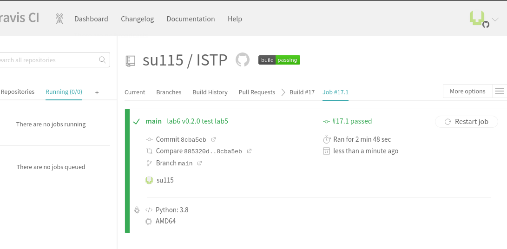
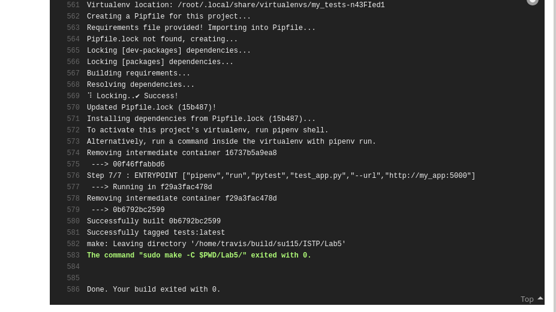

# 1-4
#### Залогінився в Travis CI створив .travis.yml
# 6
#### Переписав білд для Lab2

#### Використавши docker compose збілдив необхідні контейнери

#### make збілдив все необхідне із лаби 5

#### https://travis-ci.com/github/su115/ISTP/jobs/473432779
#### Lab6 виконана.

